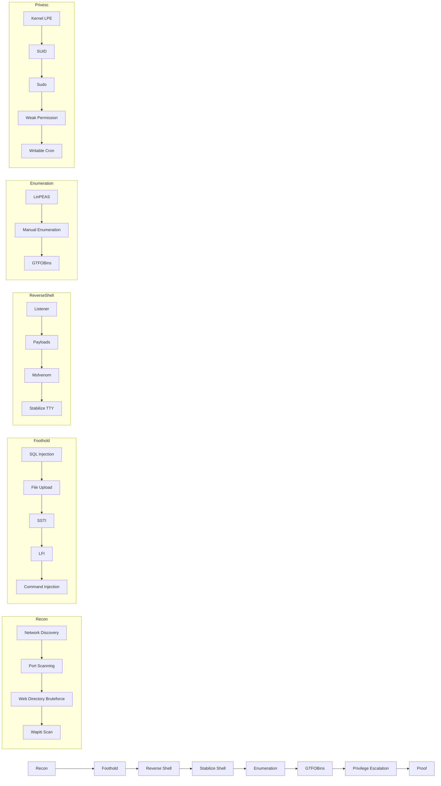

# 🛡️ Pentesting CheatSheet — Lab Reference

> **Referensi lengkap untuk penetration testing:**  
> **Recon** → **Foothold** → **Reverse Shell** → **Enumeration** → **Privilege Escalation** → **Proof**

---

## 📁 Struktur Direktori

```
.
├── 📂 00-recon/                  # Reconnaissance: pengenalan target
│   ├── 🔍 Network_Discovery.md     # Temukan host aktif di jaringan
│   ├── 📡 Port_Scanning.md         # Identifikasi layanan terbuka
│   ├── 🛡️ Wapiti Vulnerability Scanner.md  # Audit otomatis kerentanan web
│   └── 🌐 Web_Directory_Bruteforce.md     # Cari direktori tersembunyi
├── 📂 01-initial-foothold/       # Mendapatkan akses awal
│   ├── 💉 Command_Injection.md     # Eksekusi command arbitrer
│   ├── 📤 File_Upload.md           # Unggah webshell
│   ├── 📂 LFI.md                   # Include file lokal
│   ├── 🗃️ SQL_Injection.md         # Eksploitasi kerentanan SQL
│   └── 🎨 SSTI.md                  # Injeksi template sisi server
├── 📂 02-reverse-shell/          # Membangun koneksi balik ke attacker
│   ├── 💉 Command_Injection.md     # Reverse shell via command injection
│   ├── 👂 Listener.md              # Siapkan penerima di attacker
│   ├── 🛠️ Msfvenom.md              # Generate payload dengan Metasploit
│   └── 🪟 Stabilize_TTY.md         # Jadikan shell interaktif
├── 📂 03-enumeration/            # Gathering informasi sistem
│   ├── ⚙️ LinPEAS.md               # Otomatisasi enumeration Linux
│   ├── ✍️ Manual_Enumeration.md    # Teknik enumeration manual
│   └── 🐧 GTFOBins.md              # Eksploitasi binary SUID/sudo
├── 📂 04-privilege-escalation/   # Naikkan privilege ke root
│   ├── 🔥 CopyFail.md              # Kernel LPE — CVE-2026-31431
│   ├── 💥 DirtyFrag.md             # Kernel LPE — CVE-2026-43284/43500
│   ├── 🚀 Kernel_LPE.md            # Ringkasan kernel exploits
│   ├── 🔑 Sudo.md                  # Konfigurasi sudo yang tidak aman
│   ├── 🔐 SUID.md                  # Manipulasi binary SUID
│   ├── 🔓 Weak_Permission.md       # File dengan permission longgar
│   └── ⏰ Writable_Cron.md         # Cron job yang dapat dimodifikasi
└── 📂 05-proof/                  # Bukti bahwa akses root sudah diperoleh
    └── ✅ Submission.md           # Tampilkan id dan hostname
```

---

## 📋 Daftar Isi Lengkap

| No | Folder | Topik | Deskripsi Singkat |
|----|--------|-------|-------------------|
| 1 | `00-recon/` | **Pengawalan** | Network discovery, port scanning, web directory bruteforce, Wapiti |
| 2 | `01-initial-foothold/` | **Mendapatkan Akses Awal** | SQL injection, file upload, SSTI, LFI, command injection |
| 3 | `02-reverse-shell/` | **Reverse Shell** | Listener, payload generation, stabilization, command injection |
| 4 | `03-enumeration/` | **Enumerasi Sistem** | LinPEAS, manual enumeration, GTFOBins |
| 5 | `04-privilege-escalation/` | **Privilege Escalation** | Kernel exploits (DirtyFrag, CopyFail), SUID, sudo, weak permissions, cron |
| 6 | `05-proof/` | **Bukti Akses** | Verifikasi `uid=0` dan hostname |

---

## 🔄 Alur Penetration Testing Umum



---

## 💡 Tips Penggunaan CheatSheet

1. **Ikuti alur**: Mulai dari recon hingga proof secara berurutan.
2. **Sesuaikan dengan target**: Tidak semua teknik perlu digunakan.
3. **Validasi hasil**: Selalu verifikasi sebelum lanjut ke tahap berikutnya.
4. **Privilege escalation**: Gunakan **LES (Linux Exploit Suggester)** untuk mencocokkan kernel dengan CVE yang tepat (DirtyFrag, CopyFail, DirtyPipe, dll).
5. **Bukti (proof)**: Selalu dokumentasikan `id` → `uid=0(root)` dan `hostname` sebagai bukti.
6. **Catatan penting**: Teknik ini hanya untuk digunakan pada sistem yang Anda miliki atau dengan izin eksplisit.

---

## ⚠️ Legal Disclaimer

Seluruh teknik dalam cheat sheet ini hanya untuk **keperluan edukasi** dan **uji penetrasi resmi** pada sistem yang Anda miliki atau sistem dengan **izin tertulis**. Penyalahgunaan terhadap sistem yang tidak berizin adalah **tindakan ilegal** dan melanggar hukum yang berlaku.
